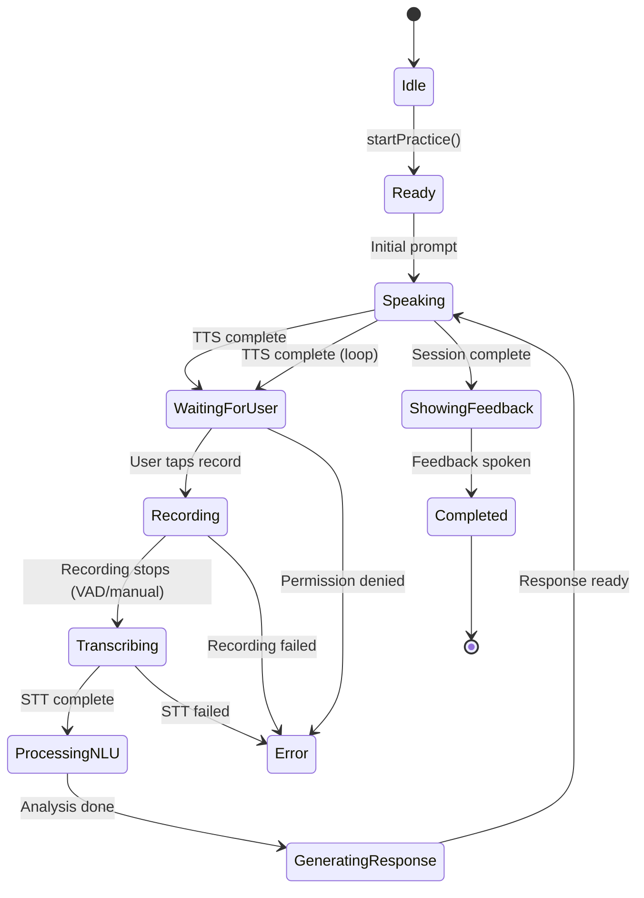

# AITalkingApp - Architecture Overview

## High-Level Architecture

```
┌─────────────────────────────────────────────────────────┐
│                    SwiftUI Views                        │
│  ┌──────────────┐  ┌──────────────┐  ┌──────────────┐  │
│  │ Scenario     │  │  Practice    │  │  History     │  │
│  │  Picker      │─▶│   Screen     │  │   View       │  │
│  └──────────────┘  └──────────────┘  └──────────────┘  │
└────────────────────────┬────────────────────────────────┘
                         │
                         ▼
┌─────────────────────────────────────────────────────────┐
│          ConversationOrchestrator (State Machine)       │
│                                                         │
│  Idle → Ready → Recording → Transcribing → NLU →       │
│  Response → Speaking → Waiting → [loop] → Feedback     │
└───┬────────────┬────────────┬────────────┬─────────────┘
    │            │            │            │
    ▼            ▼            ▼            ▼
┌─────────┐  ┌─────────┐  ┌─────────┐  ┌─────────┐
│ Audio   │  │  STT    │  │  TTS    │  │Response │
│ Service │  │ Service │  │ Service │  │ Engine  │
└────┬────┘  └────┬────┘  └─────────┘  └────┬────┘
     │            │                          │
     ▼            ▼                          ▼
┌─────────┐  ┌─────────┐              ┌──────────┐
│   VAD   │  │SFSpeech │              │Template  │
└─────────┘  └─────────┘              │ Responses│
                                      └──────────┘
                                           │
                                           ▼
                                      ┌──────────┐
                                      │ Metrics  │
                                      │ Analyzer │
                                      └──────────┘
                                           │
                                           ▼
                                      ┌──────────┐
                                      │ Storage  │
                                      │ Service  │
                                      └──────────┘
```

## Data Flow

### 1. Starting a Practice Session

```
User taps scenario
    ↓
ScenarioPicker → PracticeScreen
    ↓
ConversationOrchestrator.startPractice()
    ↓
Check permissions (Mic + STT)
    ↓
Initialize Transcript
    ↓
State → Ready
    ↓
Give initial prompt via TTS
    ↓
State → WaitingForUser
```

### 2. Recording User Response

```
User taps "Aufnehmen"
    ↓
ConversationOrchestrator.handleUserTurn()
    ↓
State → Recording
    ↓
AudioService.startRecording()
    ↓
VAD monitors silence (auto-stop after 2s silence)
    ↓
ConversationOrchestrator.stopRecording()
    ↓
State → Transcribing
```

### 3. Processing Response

```
STTService.transcribe(audioURL)
    ↓
Get German transcription + confidence
    ↓
Add to Transcript (User entry)
    ↓
State → ProcessingNLU
    ↓
ResponseEngine.generateResponse()
    ↓
Get examiner response (template-based)
    ↓
Add to Transcript (Examiner entry)
    ↓
State → Speaking
    ↓
TTSService.speak(response)
    ↓
State → WaitingForUser (loop)
```

### 4. Completing Session

```
After N turns (scenario-dependent)
    ↓
ConversationOrchestrator.completeSession()
    ↓
Finalize Transcript
    ↓
MetricsAnalyzer.generateMetrics()
    ↓
Create PracticeAttempt
    ↓
StorageService.saveAttempt()
    ↓
State → ShowingFeedback
    ↓
Display metrics + speak feedback
    ↓
State → Completed
```

## State Machine

### ConversationState Transitions



## Core Components

### Models

#### Scenario
- **Purpose**: Defines exam scenario (type, topic, prompts)
- **Key**: `ScenarioType` enum (Bildbeschreibung, Mini-Präsentation, Dialog)
- **Default scenarios**: 6 predefined (2 per type)

#### Transcript
- **Purpose**: Stores conversation history
- **Structure**: Array of `TranscriptEntry` (speaker, text, timestamp, audio URL)
- **Metrics**: Duration, entry count

#### PracticeMetrics
- **Purpose**: Performance feedback
- **Metrics**:
  - Duration, total words, WPM
  - Filler word stats
  - Lexical diversity (Type-Token Ratio)
  - Grammar score (articles, verb position, tense)
- **Output**: `PerformanceLevel` (Excellent/Good/Fair/Needs Improvement)

#### PracticeAttempt
- **Purpose**: Complete practice session record
- **Contains**: Scenario + Transcript + Metrics
- **Persistence**: JSON via StorageService

### Services

#### AudioService
- **Responsibility**: Audio I/O
- **Tech**: AVAudioEngine, AVAudioSession
- **Features**:
  - Microphone recording to WAV
  - Real-time audio level monitoring
  - VAD integration (auto-stop)
- **Permissions**: Microphone access

#### STTService
- **Responsibility**: Speech recognition
- **Tech**: SFSpeechRecognizer (German locale)
- **Mode**: On-device (iOS 17+)
- **Output**: Text + confidence score
- **Permissions**: Speech recognition access

#### TTSService
- **Responsibility**: Text-to-speech synthesis
- **Tech**: AVSpeechSynthesizer
- **Voice**: German (de-DE)
- **Config**: Rate 0.5 (learner-friendly), normal pitch
- **Async**: Uses Swift Concurrency (async/await)

#### ResponseEngine
- **Responsibility**: Generate examiner responses
- **Mode**: Template-based (rule-based, no ML)
- **Logic**:
  - Per-scenario response pools
  - Turn-based progression
  - Randomized variety
- **Feedback**: Performance-based German text

#### StorageService
- **Responsibility**: Local persistence
- **Tech**: FileManager + JSONEncoder
- **Location**: Documents directory
- **Features**:
  - Save/load attempts
  - Delete/favorite
  - Statistics (total time, average performance)

### Orchestration

#### ConversationOrchestrator
- **Role**: Central coordinator
- **Pattern**: State machine + async/await
- **Responsibilities**:
  1. Permission management
  2. State transitions
  3. Service coordination
  4. Transcript management
  5. Session lifecycle
- **Observable**: SwiftUI `@ObservableObject`

### Utils

#### MetricsAnalyzer
- **Purpose**: Analyze transcripts for feedback
- **Algorithms**:
  - **Filler detection**: Pattern matching against German filler set
  - **Lexical diversity**: Type-Token Ratio (normalized)
  - **WPM**: Word count / duration
  - **Grammar**: Heuristic pattern matching (basic)

#### VoiceActivityDetector (VAD)
- **Purpose**: Detect speech vs. silence
- **Algorithm**: Energy-based (RMS in dB)
- **Thresholds**:
  - Energy: -35dB
  - Silence duration: 2 seconds
  - Minimum speech: 0.5 seconds
- **Tech**: Accelerate framework (vDSP)

### Views

#### ScenarioPicker
- **Purpose**: Scenario selection menu
- **Layout**: Grouped list by scenario type
- **Navigation**: → PracticeScreen, → AttemptsHistoryView

#### PracticeScreen
- **Purpose**: Main practice interface
- **Dynamic UI**: Changes based on `ConversationState`
- **Controls**: Record/Stop buttons (conditional)
- **Feedback**: Live state visualization (icons + text)

#### TranscriptScreen
- **Purpose**: Review conversation
- **Layout**: Chronological message list
- **Metadata**: Timestamps, confidence scores, speaker icons

#### AttemptsHistoryView
- **Purpose**: Browse past sessions
- **Features**:
  - Statistics summary
  - Type filter
  - Swipe actions (delete/favorite)
  - Tap to view transcript

## Technology Stack

### iOS SDK
- **SwiftUI**: UI framework
- **AVFoundation**: Audio I/O
- **Speech**: STT (SFSpeechRecognizer)
- **Foundation**: Data, storage
- **Accelerate**: DSP (VAD)

### Language
- **Swift 5.9+**
- **Async/await**: Service calls
- **Combine**: Reactive updates (`@Published`)

### Storage
- **JSON**: Codable persistence
- **FileManager**: Local file system
- **WAV**: Audio format

### Deployment
- **Target**: iOS 16.0+ (recommended 17.0+)
- **Device**: iPhone (optimized)
- **Signing**: Free provisioning (7-day cert)

## Performance Considerations

### On-Device Constraints
- **STT latency**: ~1-3s for 30s audio (SFSpeech)
- **TTS latency**: Real-time (instant start)
- **VAD processing**: Real-time (10ms window)
- **Storage**: ~1-2MB per 5-min session (audio + JSON)

### Optimization Opportunities
1. **Audio compression**: Use AAC instead of WAV (reduce storage)
2. **Transcript caching**: Persist intermediate states
3. **VAD tuning**: Adjust thresholds per user
4. **Metrics async**: Run analysis in background

## Future Enhancements (Post-MVP)

### Planned
1. **Whisper integration**: Full offline STT (no API limits)
2. **NLP grammar**: CoreML model for grammar analysis
3. **Image support**: Display images for Bildbeschreibung
4. **Export**: PDF reports, share transcripts
5. **Cloud sync**: iCloud for cross-device history

### Experimental
- **LLM responses**: On-device Llama 3 (feature flag)
- **Pronunciation scoring**: Phoneme-level analysis
- **Adaptive scenarios**: Difficulty adjustment based on metrics

## Development Guidelines

### Adding a New Scenario
1. Add entry to `Scenario.defaultScenarios`
2. Update `ResponseEngine` with response templates
3. Test all conversation branches

### Adding a Metric
1. Extend `PracticeMetrics` struct
2. Implement analyzer in `MetricsAnalyzer`
3. Update `FeedbackView` to display metric
4. Add to feedback text in `ResponseEngine`

### Debugging State Issues
1. Check `ConversationOrchestrator.state` value
2. Verify event triggers (`ConversationEvent`)
3. Ensure async operations complete
4. Check permissions (mic/STT)

---

**Last Updated**: 21.10.2025
